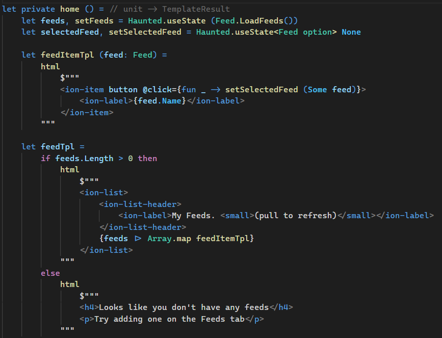

# Fable.Lit

Fable.Lit is a collection of tools to help you write [Fable](https://fable.io/) apps by embedding HTML code into your F# code with the power of [lit-html](https://lit.dev/docs/libraries/standalone-templates/). Thanks to this, you can use HTML from a designer or a [component library](https://ionicframework.com/docs/api/) right away, without any kind of conversion to F#. lit-html only weighs 3KB minified and gzipped so it's very cheap to integrate in your existing app (see below for React integration). And if you're using VS Code and install the [Highlight HTML/SQL templates in F#](https://marketplace.visualstudio.com/items?itemName=alfonsogarciacaro.vscode-template-fsharp-highlight) extension the integration will be even smoother:



There's an example in the `sample` directory, but you can find [here a more detailed tutorial](https://dev.to/tunaxor/using-lit-html-with-f-3i8b) by Angel Munoz.

## Requirements

Fable.Lit packages require lit-html 2 from npm and fable 3.3 dotnet tool which are both, at the time of writing, in prerelease state.

```
npm install html-lit@next
dotnet tool install fable --version 3.3.0-beta-002
```

Then, in the directory of your .fsproj, install the packages you need (see below for details), which are also in prelease. Note the package ids are prefixed by `Fable.` but not the actual namespaces.

```
dotnet add package Fable.Lit --prerelease
dotnet add package Fable.Lit.React --prerelease
dotnet add package Fable.Lit.Elmish --prerelease
dotnet add package Fable.Lit.Feliz --prerelease
```

## Lit

Fable.Lit contains bindings and extra helpers for lit-html. Please read [lit-html documentation](https://lit.dev/docs/templates/overview/) to learn how Lit templates work.

When you open the `Lit` namespace, you will have access to:

- `html` and `svg` helpers, which convert F# interpolated strings into lit-html templates
- `LitHtml` static class containing _raw_ bindings for lit-html (normally you don't need to use this)
- `Lit` static class containing wrappers for lit-html in a more F# idiomatic fashion

E.g. lit-html [repeat](https://lit.dev/docs/templates/directives/#repeat) directive becomes `Lit.mapUnique` to map a sequence of items into `Lit.TemplateResult` and assign each a unique id. This is important to identify the items when the list is going to be sorted or filtered. For static lists passing the sequence directly just works.

```fsharp
let renderList items =
    let renderItem item =
        html $"""<li>Value: <strong>{item.Value}</strong></li>"""

    html $"""<ul>{items |> Lit.mapUnique (fun x -> x.Id) renderItem}</ul>"""
```

### HookComponent

Fable.Lit includes the `HookComponent` attribute. When you decorate a view function with it, this lets you use [hooks](https://reactjs.org/docs/hooks-overview.html) in a similar way as [ReactComponent](). Hook support is included in Fable.Lit's F# code and doesn't require any extra JS dependency besides lit-html.

```fsharp
[<HookComponent>]
let NameInput() =
    // Lit.Hook API is currently evolving, we try to emulate React's API but there may be some differences
    let value, setValue = Hook.useState "World"
    let inputRef = Hook.useRef<HTMLInputElement>()

    html $"""
      <div class="content">
        <p>Hello {value}!</p>
        <input
          value={value}
          {Lit.refValue inputRef}
          @focus={fun _ ->
            inputRef.value |> Option.iter (fun el -> el.select())}
          @keyup={fun (ev: Event) ->
            ev.target.Value |> setValue}>
      </div>
    """
```

> Note that hook components are just a way to keep state between renders and are not [web components](https://www.webcomponents.org/introduction). We plan to add bindings to define web components with [lit](https://lit.dev) in the near future. Also check [Fable.Haunted](https://github.com/AngelMunoz/Fable.Haunted) by Angel Munoz to define actual web components with React-style hooks.

### Hook.useElmish

Thanks to the great work by [Cody Johnson](https://twitter.com/Cody_S_Johnson) with [Feliz.UsElmish](https://zaid-ajaj.github.io/Feliz/#/Hooks/UseElmish), Fable.Lit HookComponents also include `useElmish` hook to manage the internal state of your components using the model-view-update architecture.

```fsharp
open Elmish
open Lit

type Model = ..
type Msg = ..

let init() = ..
let update msg model = ..
let view model dispatch = ..

[<HookComponent>]
let Clock(): TemplateResult =
    let model, dispatch = Hook.useElmish(init, update)
    view model dispatch
```

## Lit.React

Fable.Lit.React package contains helpers to integrate lit-html with React in both directions: either by rendering a React component with an HTML template or by embedding a React component in an HTML template. This makes it possible to add raw HTML to your apps whenever you need it, no matter you're using [Fable.React](https://github.com/fable-compiler/fable-react/) bindings or [Zaid Ajaj](https://twitter.com/zaid_ajaj)'s [Feliz](https://zaid-ajaj.github.io/Feliz/) API.

> If you're comfortable with [JSX](https://reactjs.org/docs/introducing-jsx.html) and Typescript/JS, it's also easy to [invoke them from Feliz](https://zaid-ajaj.github.io/Feliz/#/Feliz/UsingJsx) if that suits your needs better.

Use `React.lit_html` or `React.lit_svg` to include the string template directly. Or `React.ofLit` to transform `Lit.TemplateResult` into `ReactElement`. These helpers use hooks so they must be called directly in the root of a React component.

```fsharp
[<ReactComponent>]
let Clock () =
    let time, setTime = React.useState DateTime.Now

    React.useEffectOnce(fun () ->
        let id = JS.setInterval (fun _ -> DateTime.Now |> setTime) 1000
        React.createDisposable(fun () ->
            JS.clearInterval id))

    // If the template were in another function we would call
    // view time |> React.ofLit

    React.lit_html $"""
      <svg viewBox="0 0 100 100"
           width="350px">
        <circle
          cx="50"
          cy="50"
          r="45"
          fill="#0B79CE"></circle>

        {clockHand time.AsHour}
        {clockHand time.AsMinute}
        {clockHand time.AsSecond}

        <circle
          cx="50"
          cy="50"
          r="3"
          fill="#0B79CE"
          stroke="#023963"
          stroke-width="1">
        </circle>
      </svg>
      """
```

Use `React.toLit` to transform a React component into a lit-html renderer function. Store the transformed function in a static value to make sure a new React component is not instantiated for every render:

```fsharp
module ReactLib =
    open Fable.React
    open Fable.React.Props

    [<ReactComponent>]
    let MyComponent showClock =
        let state = Hooks.useState 0
        div [ Class "card" ] [
            div [ Class "card-content" ] [
                div [ Class "content" ] [
                    p [] [str $"""I'm a React component. Clock is {if showClock then "visible" else "hidden"}"""]
                    button [
                        Class "button"
                        OnClick (fun _ -> state.update(state.current + 1))
                    ] [ str $"""Clicked {state.current} time{if state.current = 1 then "" else "s"}!"""]
                ]
            ]
        ]

open Lit

let ReactLitComponent =
    React.toLit ReactLib.MyComponent

// Now you can embed the React component into your lit-html template
let view model dispatch =
    html $"""
      <div class="vertical-container">
        {ReactLitComponent model.ShowClock}
        {if model.ShowClock then Clock.Clock() else Lit.nothing}
      </div>
    """
```

## Lit.Elmish

Fable.Lit.Elmish allows you to write a frontend app using the popular [Elmish](https://elmish.github.io/) library by [Eugene Tolmachev](https://github.com/et1975) with a view function returning `Lit.TemplateResult`. The package also includes support for [Hot Module Replacement](https://webpack.js.org/concepts/hot-module-replacement/) out-of-the-box thanks to [Maxime Mangel](https://twitter.com/MangelMaxime) original work with Elmish.HMR.

```fsharp
open Elmish
open Lit

type Model = ..
type Msg = ..

let init() = ..
let update msg model = ..
let view model dispatch = ..

open Lit.Elmish
open Lit.Elmish.HMR

Program.mkProgram initialState update view
|> Program.withLit "app-container"
|> Program.run
```

## Lit.Feliz

Fable.Lit.Feliz package makes it possible to build lit-html templates in a type-safe manner using Feliz.Engine (check [here the differences](https://github.com/alfonsogarciacaro/Feliz.Engine) between _original_ Feliz and Feliz.Engine APIs).

```fsharp
let buttonFeliz (model: Model) dispatch =
    Feliz.toLit <| Html.button [
        Attr.className "button"
        Ev.onClick (fun _ -> ToggleClock |> dispatch)
        Html.text (if model.ShowClock then "Hide clock" else "Show clock")
    ]
```

The only thing you need to take into account is templates are built once and then cached (this is necessary because of the way lit-html 2 templates work), so you cannot change the structure of a template dynamically with conditions. This doesn't mean that templates need to be static forever, but you need to "compile" (that is, convert from `Lit.Feliz.Node` to `Lit.TemplateResult` with `Feliz.toLit`) any nested structure that is bound to change. The exception to this are CSS styles and single text nodes, which are considered values and not structure, so they can change dynamically.

```fsharp
let buttonFeliz (model: Model) dispatch =
    Feliz.toLit <| Html.button [
        Attr.className "button"
        Ev.onClick (fun _ -> ToggleClock |> dispatch)

        // This doesn't work
        // if model.ShowClock then Html.text "Hide clock"
        // else Html.strong "Show clock"

        // Do this instead
        Feliz.ofLit <|
            if model.ShowClock then Lit.ofText "Hide clock"
            else Feliz.toLit <| Html.strong "Show clock"

        // Alternatively you can just embed a Lit template in a Feliz node
        // if model.ShowClock then Html.text "Hide clock"
        // else Feliz.lit_html $"""<strong>Show clock</strong>"""
    ]
```

This is actually the same you would do with HTML templates, as you need to put conditions in a hole of the interpolated strings and declare the nested template externally.

```fsharp
let buttonLit (model: Model) dispatch =
    let strong txt =
        html $"<strong>{txt}</strong>"

    html $"""
        <button class="button"
                @click={fun _ -> ToggleCock |> dispatch}>
          {if model.ShowClock then Lit.ofText "Hide Clock" else strong "Show Clock"}
        </button>
    """
```

Even if you prefer to use HTML templates, Lit.Feliz contains a useful helper to declare inline styles with a nicely typed and self-discoverable API:

```fsharp

module Styles =
    let verticalContainer = [
        Css.marginLeft(rem 2)
        Css.displayFlex
        Css.justifyContentCenter
        Css.alignItemsCenter
        Css.flexDirectionColumn
    ]

let view model dispatch =
    html $"""
      <div style={Feliz.styles Styles.verticalContainer}>
        ...
      </div>
    """
```