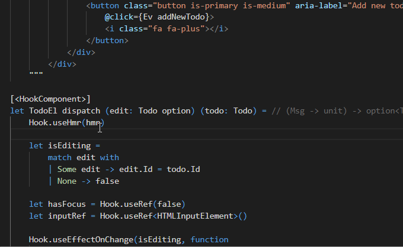

---
title:
layout: nacara-navbar-only
---

<!-- Disable the copy-button on all the elements contained inside the container (all this page) -->

    <!--
        Selling points
        For the selling points we use CSS grid instead of Bulma columns because we want all the box to have the same height.
        This is not something possible to do dynamically using Flexbox/Bulma columns system
    -->
    <section class="section">
        <h2 class="title is-2 has-text-primary has-text-centered">
            Fable.Lit
        </h2>
        

            Fable.Lit is a comprehensive suite of tools to write <a href="https://fable.io">Fable</a> apps by embedding HTML into your F# code with the power of Google's <a href="https://lit.dev">Lit</a>.
        

        

            Fable.Lit lets you take full advantage of modern web development, including blazing-fast hot reloading, best-practice component testing and a VS Code extension.
        

        

            
        

         
        

            <a href="docs/getting-started.html">
                <button class="button is-info is-large">
                    Get started
                </button>
            </a>
        

    </section>

